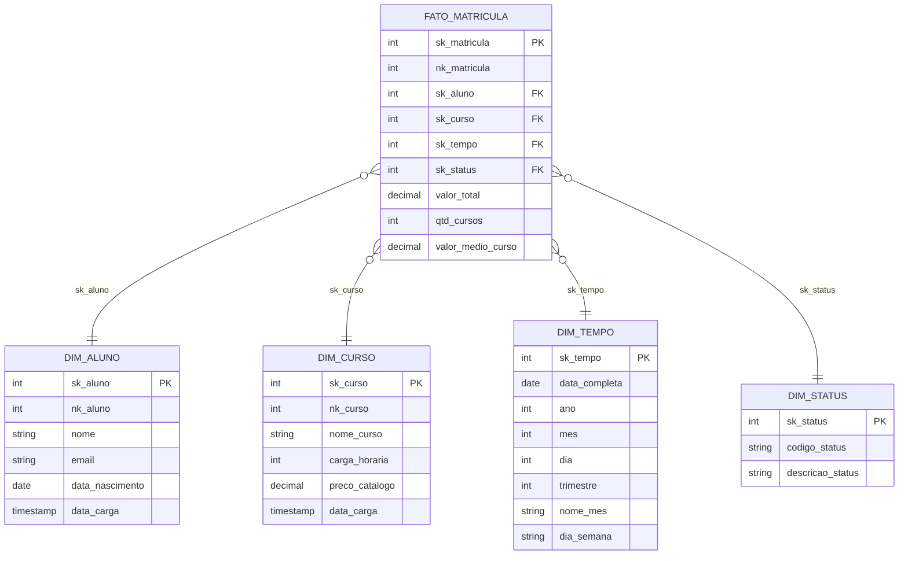

# Modelagem de Dados Analítica (Data Warehouse)

Este documento detalha a modelagem da camada analítica (DW) do sistema. O modelo foi construído utilizando a **Modelagem Dimensional baseada na metodologia de Ralph Kimball**. A estrutura escolhida é o **Star Schema**, ideal para agregação rápida, relatórios e extração de KPIs.

## Raciocínio (Abordagem Kimball)

- **Processo de Negócio:** Foco no evento central do negócio (o ato da matrícula), modelando as dimensões ao redor desse evento.
- **Simplicidade de Consulta:** Evita "cascatas" de JOINs complexos presentes na 2NF; a tabela Fato e as Dimensões têm relação direta (Star Schema).
- **Performance:** Otimizado para cálculos agregados e `GROUP BY` nas ferramentas de relatórios/BI.
- **Isolamento via Surrogate Keys (SK):** O uso de chaves artificiais (SK) separa a identificação analítica da identificação operacional (Natural Keys).
- **Suporte a SCD Tipo 2 (Slowly Changing Dimensions):** A arquitetura de SKs deixa o DW nativamente preparado para rastreamento de histórico (uma exigência da metodologia Kimball). Se um curso sofrer alteração de preço, por exemplo, nós não faremos um `UPDATE` destrutivo apagando o valor antigo. Inseriremos uma nova linha na `dim_curso` com o novo preço, gerando uma nova `sk_curso` (mantendo a mesma `nk_curso`). Matrículas antigas continuarão apontando para a `sk` antiga, garantindo a integridade dos relatórios financeiros do passado.

## Modelo Conceitual

**Granularidade da Fato:** 1 linha por Matrícula (Nível de Matrícula).



## Modelo Lógico

### dim_aluno

| Campo | Tipo | Chave | Descrição |
|---|---|---|---|
| sk_aluno | INTEGER | PK | Surrogate key |
| nk_aluno | INTEGER | NK | Natural key (id_aluno do OLTP) |
| nome | VARCHAR(100) | — | Nome do aluno |
| email | VARCHAR(100) | — | Email do aluno |
| data_nascimento | DATE | — | Data de nascimento |
| data_carga | TIMESTAMP | — | Data/hora da carga ETL |

### dim_curso

| Campo | Tipo | Chave | Descrição |
|---|---|---|---|
| sk_curso | INTEGER | PK | Surrogate key |
| nk_curso | INTEGER | NK | Natural key (id_curso do OLTP) |
| nome_curso | VARCHAR(100) | — | Nome do curso |
| carga_horaria | INTEGER | — | Carga horária |
| preco_catalogo | DECIMAL(10,2) | — | Preço atual do catálogo |
| data_carga | TIMESTAMP | — | Data/hora da carga ETL |

### dim_tempo

| Campo | Tipo | Chave | Descrição |
|---|---|---|---|
| sk_tempo | INTEGER | PK | Surrogate key |
| data_completa | DATE | — | Data completa (YYYY-MM-DD) |
| ano | INTEGER | — | Ano (ex: 2026) |
| mes | INTEGER | — | Mês (1-12) |
| dia | INTEGER | — | Dia do mês |
| trimestre | INTEGER | — | Trimestre (1-4) |
| nome_mes | VARCHAR(20) | — | Nome do mês (Janeiro, Fevereiro...) |
| dia_semana | VARCHAR(20) | — | Dia da semana (Segunda, Terça...) |

### dim_status

| Campo | Tipo | Chave | Descrição |
|---|---|---|---|
| sk_status | INTEGER | PK | Surrogate key |
| codigo_status | VARCHAR(30) | — | Código (Ativa, Trancada, Concluída) |
| descricao_status | VARCHAR(100) | — | Descrição longa do status |

### fato_matricula

| Campo | Tipo | Chave | Descrição |
|---|---|---|---|
| sk_matricula | INTEGER | PK | Surrogate key da fato |
| nk_matricula | INTEGER | — | Natural key (id_matricula do OLTP) |
| sk_aluno | INTEGER | FK → dim_aluno | Referência à dimensão aluno |
| sk_curso | INTEGER | FK → dim_curso | Referência à dimensão curso |
| sk_tempo | INTEGER | FK → dim_tempo | Referência à dimensão tempo |
| sk_status | INTEGER | FK → dim_status | Referência à dimensão status |
| valor_total | DECIMAL(10,2) | — | Valor total da matrícula |
| qtd_cursos | INTEGER | — | Quantidade de cursos na matrícula |
| valor_medio_curso | DECIMAL(10,2) | — | Ticket médio por curso |

## Modelo Físico (DDL)

```sql
CREATE TABLE dim_aluno (
    sk_aluno SERIAL PRIMARY KEY,
    nk_aluno INTEGER NOT NULL,
    nome VARCHAR(100) NOT NULL,
    email VARCHAR(100),
    data_nascimento DATE,
    data_carga TIMESTAMP DEFAULT CURRENT_TIMESTAMP
);

CREATE TABLE dim_curso (
    sk_curso SERIAL PRIMARY KEY,
    nk_curso INTEGER NOT NULL,
    nome_curso VARCHAR(100) NOT NULL,
    carga_horaria INTEGER,
    preco_catalogo DECIMAL(10,2),
    data_carga TIMESTAMP DEFAULT CURRENT_TIMESTAMP
);

CREATE TABLE dim_tempo (
    sk_tempo SERIAL PRIMARY KEY,
    data_completa DATE NOT NULL,
    ano INTEGER NOT NULL,
    mes INTEGER NOT NULL,
    dia INTEGER NOT NULL,
    trimestre INTEGER NOT NULL,
    nome_mes VARCHAR(20),
    dia_semana VARCHAR(20)
);

CREATE TABLE dim_status (
    sk_status SERIAL PRIMARY KEY,
    codigo_status VARCHAR(30) NOT NULL,
    descricao_status VARCHAR(100)
);

CREATE TABLE fato_matricula (
    sk_matricula SERIAL PRIMARY KEY,
    nk_matricula INTEGER NOT NULL,
    sk_aluno INTEGER NOT NULL REFERENCES dim_aluno(sk_aluno),
    sk_curso INTEGER NOT NULL REFERENCES dim_curso(sk_curso),
    sk_tempo INTEGER NOT NULL REFERENCES dim_tempo(sk_tempo),
    sk_status INTEGER NOT NULL REFERENCES dim_status(sk_status),
    valor_total DECIMAL(10,2),
    qtd_cursos INTEGER,
    valor_medio_curso DECIMAL(10,2)
);
```

## Próximos Passos (Camada Semântica)

Este Star Schema físico servirá como base para a criação da **Camada Semântica**. Ao final do projeto (Milestone 6), as tabelas acima não serão consultadas diretamente pelo time de negócio, mas sim através de **Views Analíticas SQL** criadas no banco de dados. Essas Views abstrairão as complexidades de JOINs e agregarão os indicadores chave (KPIs) exigidos no Mini-Case.
