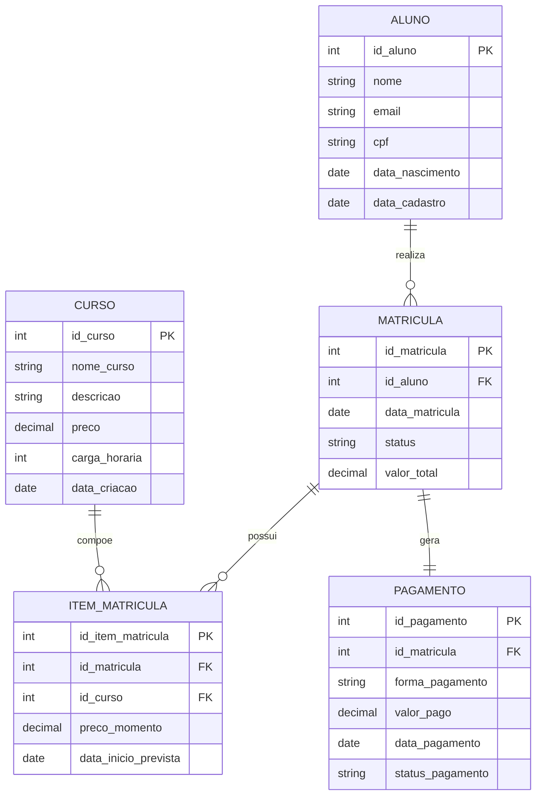

# Modelagem de Dados Operacional (OLTP)

Este documento detalha a modelagem de dados da camada operacional (OLTP) do sistema de gestão educacional. O banco foi desenhado na Segunda Forma Normal (2NF) para equilibrar integridade referencial e simplicidade no gerenciamento transacional.

## Modelo Conceitual

O modelo conceitual mapeia as principais entidades e os relacionamentos do domínio de negócio.

**Entidades:**
- **Aluno**: Representa um estudante matriculado na instituição.
- **Curso**: Representa uma formação ou disciplina oferecida pela escola.
- **Matrícula**: Representa o vínculo formal de um aluno com a instituição em um determinado momento.
- **Item da Matrícula**: Representa os cursos específicos incluídos em uma matrícula.
- **Pagamento**: Representa a quitação financeira de uma matrícula.

**Relacionamentos e Regras de Negócio:**
- Um **Aluno** pode ter muitas **Matrículas** (1:N).
- Uma **Matrícula** pertence a apenas um **Aluno**.
- Uma **Matrícula** pode englobar um ou mais **Itens de Matrícula** (1:N).
- Um **Curso** pode estar associado a muitos **Itens de Matrícula** (1:N).
- Cada **Matrícula** possui um único registro de **Pagamento** (1:1).



## Modelo Lógico

Definição estrutural das tabelas com seus respectivos campos e chaves.

### aluno
| Campo | Tipo | Chave | Restrição |
|---|---|---|---|
| id_aluno | INTEGER | PK | AUTO INCREMENT |
| nome | VARCHAR(100) | — | NOT NULL |
| email | VARCHAR(100) | — | UNIQUE |
| cpf | VARCHAR(14) | — | UNIQUE |
| data_nascimento | DATE | — | — |
| data_cadastro | DATE | — | DEFAULT CURRENT_DATE |

### curso
| Campo | Tipo | Chave | Restrição |
|---|---|---|---|
| id_curso | INTEGER | PK | AUTO INCREMENT |
| nome_curso | VARCHAR(100) | — | NOT NULL |
| descricao | TEXT | — | — |
| preco | DECIMAL(10,2) | — | NOT NULL |
| carga_horaria | INTEGER | — | NOT NULL |
| data_criacao | DATE | — | DEFAULT CURRENT_DATE |

### matricula
| Campo | Tipo | Chave | Restrição |
|---|---|---|---|
| id_matricula | INTEGER | PK | AUTO INCREMENT |
| id_aluno | INTEGER | FK → aluno | NOT NULL |
| data_matricula | DATE | — | NOT NULL |
| status | VARCHAR(30) | — | DEFAULT 'Ativa' |
| valor_total | DECIMAL(10,2) | — | — |

### item_matricula
| Campo | Tipo | Chave | Restrição |
|---|---|---|---|
| id_item_matricula | INTEGER | PK | AUTO INCREMENT |
| id_matricula | INTEGER | FK → matricula | NOT NULL |
| id_curso | INTEGER | FK → curso | NOT NULL |
| preco_momento | DECIMAL(10,2) | — | NOT NULL |
| data_inicio_prevista | DATE | — | — |

### pagamento
| Campo | Tipo | Chave | Restrição |
|---|---|---|---|
| id_pagamento | INTEGER | PK | AUTO INCREMENT |
| id_matricula | INTEGER | FK → matricula | NOT NULL, UNIQUE |
| forma_pagamento | VARCHAR(50) | — | — |
| valor_pago | DECIMAL(10,2) | — | — |
| data_pagamento | DATE | — | — |
| status_pagamento | VARCHAR(30) | — | — |

## Modelo Físico (DDL)

```sql
CREATE TABLE aluno (
    id_aluno INTEGER PRIMARY KEY,
    nome VARCHAR(100) NOT NULL,
    email VARCHAR(100) UNIQUE,
    cpf VARCHAR(14) UNIQUE,
    data_nascimento DATE,
    data_cadastro DATE DEFAULT CURRENT_DATE
);

CREATE TABLE curso (
    id_curso INTEGER PRIMARY KEY,
    nome_curso VARCHAR(100) NOT NULL,
    descricao TEXT,
    preco DECIMAL(10,2) NOT NULL,
    carga_horaria INTEGER NOT NULL,
    data_criacao DATE DEFAULT CURRENT_DATE
);

CREATE TABLE matricula (
    id_matricula INTEGER PRIMARY KEY,
    id_aluno INTEGER NOT NULL,
    data_matricula DATE NOT NULL,
    status VARCHAR(30) DEFAULT 'Ativa',
    valor_total DECIMAL(10,2),
    FOREIGN KEY (id_aluno) REFERENCES aluno(id_aluno)
);

CREATE TABLE item_matricula (
    id_item_matricula INTEGER PRIMARY KEY,
    id_matricula INTEGER NOT NULL,
    id_curso INTEGER NOT NULL,
    preco_momento DECIMAL(10,2) NOT NULL,
    data_inicio_prevista DATE,
    FOREIGN KEY (id_matricula) REFERENCES matricula(id_matricula),
    FOREIGN KEY (id_curso) REFERENCES curso(id_curso)
);

CREATE TABLE pagamento (
    id_pagamento INTEGER PRIMARY KEY,
    id_matricula INTEGER NOT NULL,
    forma_pagamento VARCHAR(50),
    valor_pago DECIMAL(10,2),
    data_pagamento DATE,
    status_pagamento VARCHAR(30),
    FOREIGN KEY (id_matricula) REFERENCES matricula(id_matricula)
);
```

## Decisões de Design (Rationale)

- **Adoção de 2NF:** Elimina dependências parciais; não seguimos para 3NF pois adicionaria complexidade excessiva sem ganho claro.
- **Entidade `item_matricula`:** Necessária para resolver o relacionamento N:N entre Matrícula e Curso e para registrar o `preco_momento` isolado da tabela `curso` (pois os preços podem flutuar).
- **Pagamento 1:1:** Simplifica o tracking financeiro base no conceito de que cada matrícula é quitada via uma transação principal de pagamento.
